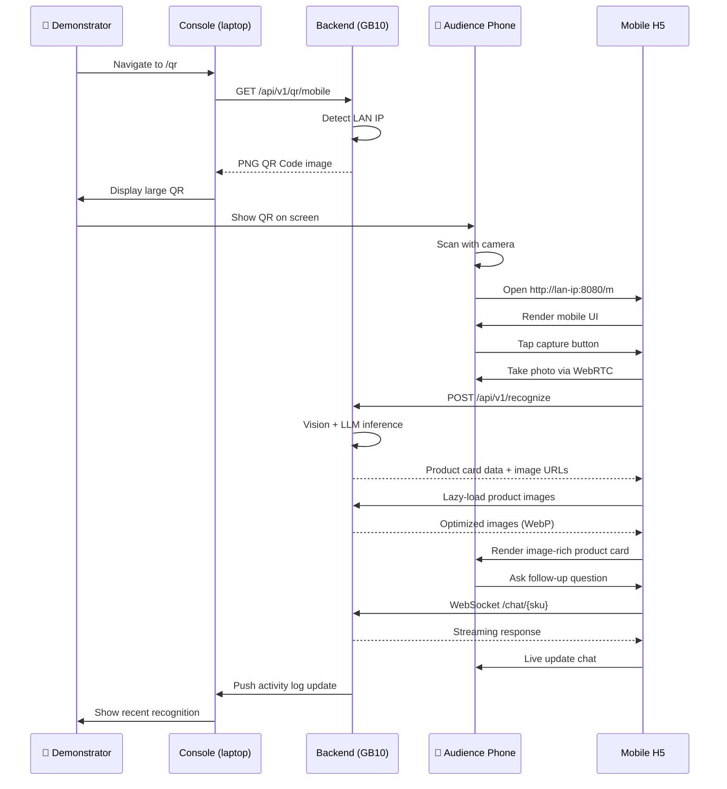

# Architecture Design

## Overview

Smart Shopping Guide Agent is the first scenario application built on top of the **KWeaver Box** edge AI platform. This document describes its end-to-end architecture and integration points.

> **Companion document**: see [`prd.md`](prd.md) for the full Product Requirements Document.

## Key Design Principles

1. **Image-First Experience**: Images are not decoration; they are the primary content
2. **Dual Frontend**: Server-side Console (admin) + Mobile H5 (end-user)
3. **QR Code as Entry**: Customers scan to access mobile experience instantly
4. **Edge-First**: All AI inference happens on-premise, data never leaves
5. **Demo-Resilient**: Demo mode ensures showcases never fail visibly

## High-Level Architecture

```
┌──────────────────────────────────────────────────────────────┐
│                    Client Layer                               │
├──────────────────────────────────────────────────────────────┤
│                                                                │
│   💻 Demonstrator's Laptop          📱 Audience's Phone        │
│   (Console - Desktop UI)            (H5 - Mobile UI)           │
│           │                                  │                 │
│           │  Browser navigates to            │  Browser scans  │
│           │  http://server:8080              │  QR Code        │
└───────────┼──────────────────────────────────┼─────────────────┘
            │                                  │
            ▼                                  ▼
┌──────────────────────────────────────────────────────────────┐
│           Edge Compute Box (FusionXpark GB10 / etc.)          │
├──────────────────────────────────────────────────────────────┤
│                                                                │
│  ┌────────────────────────────────────────────────────────┐  │
│  │  FastAPI Service (Python, Single Container)             │  │
│  │                                                          │  │
│  │  Routes:                                                 │  │
│  │  ├── /              → Console SPA (static)              │  │
│  │  ├── /m             → Mobile H5 SPA (static)            │  │
│  │  ├── /api/v1/*      → Backend API                        │  │
│  │  ├── /images/*      → Product images (with resize)       │  │
│  │  └── /docs          → Swagger UI                         │  │
│  └────┬───────────────────┬──────────────────┬─────────────┘  │
│       │                   │                  │                 │
│       ▼                   ▼                  ▼                 │
│  ┌─────────┐         ┌─────────┐         ┌──────────────┐    │
│  │ Qwen2.5 │         │ Qdrant  │         │ Knowledge    │    │
│  │ -VL-7B  │         │ Vector  │         │ Base (YAML)  │    │
│  │ (GPU)   │         │ DB      │         │ + Images     │    │
│  └─────────┘         └─────────┘         └──────────────┘    │
│       ▲                   ▲                      ▲            │
│       └───────────────────┴──────────────────────┘            │
│                  All local, no external calls                 │
└──────────────────────────────────────────────────────────────┘
```

## Component Responsibilities

### Server-Side Console (`frontend-console/`)

**For**: Demonstrator, Admin, Decision-maker

**Key Pages**:
- **Dashboard** - service status, today's stats
- **QR Code Page** ⭐ - displays large QR for audience to scan (the demo hub)
- **Products** - manage knowledge base entries with image upload
- **Models** - tune AI model parameters
- **Logs** - recent recognition activity
- **Settings** - port, paths, demo mode toggle

**Tech**: Vue 3 + Element Plus / Naive UI (desktop-grade)

### Mobile H5 (`frontend-h5/`)

**For**: Customer, Sales staff

**Key Pages**:
- **Camera Page** - shoot product
- **Result Page** - rich product card with images, AI guide, related products
- **Chat Page** - follow-up Q&A

**Tech**: Vue 3 + Vant (mobile-optimized)

### Backend Service (`backend/`)

**Single FastAPI process** that:
1. Serves both frontend SPAs as static files
2. Hosts product images with dynamic resizing
3. Runs Qwen2.5-VL inference on GPU
4. Manages YAML knowledge base + Qdrant vector index
5. Generates QR codes dynamically based on detected LAN IP

## Demo Flow Architecture

The demo experience is designed around **a single QR code scan event**:



## Data Architecture

### Knowledge Base Storage

```
backend/
├── knowledge/
│   ├── products/                    # YAML files, one per SKU
│   │   ├── iphone-15-pro.yaml
│   │   ├── airpods-pro-2.yaml
│   │   └── ...
│   ├── images/                      # All product images
│   │   ├── iphone-15-pro-hero.jpg
│   │   ├── iphone-15-pro-front.jpg
│   │   ├── feature-titanium.jpg
│   │   └── ...
│   └── schema.yaml                  # Schema definition
```

### Image Serving

Images are served via FastAPI static file middleware with dynamic resizing:

| URL | Behavior |
|-----|----------|
| `/images/iphone-15-pro-hero.jpg` | Original |
| `/images/iphone-15-pro-hero.jpg?w=200` | Resized to 200px wide |
| `/images/iphone-15-pro-hero.jpg?w=800&q=75` | 800px wide, 75% quality |

**Auto WebP**: When client `Accept: image/webp`, JPG converts to WebP for ~30% smaller payload.

**Cache headers**: 1-day browser cache + ETag for instant refetch.

### Vector Index (Qdrant)

Used for **related product search** based on semantic similarity:

```
Product YAML → BGE-M3 embedding → Qdrant vector
                                       ↓
Query: "find products similar to iPhone 15 Pro"
                                       ↓
Top-K SKUs → fetch full data from YAML cache
```

Embedded mode (no separate Qdrant container needed for demo).

## Performance Targets

| Metric | Target | Rationale |
|--------|--------|-----------|
| Vision recognition latency | < 1.5s | User waits with anticipation, not anxiety |
| Guide first-token latency | < 2s | Streaming starts before patience runs out |
| End-to-end (capture → see guide) | < 5s | The "magic threshold" for demos |
| Image lazy load | Instant on scroll | Smooth scrolling experience |
| Concurrent users (GB10) | 5-10 | Demo + small store reality |
| Concurrent users (DGX Spark) | 50+ | Larger deployments |

## Security & Privacy

### Demo Phase

- **Network**: Backend binds to `0.0.0.0:8080` for LAN access
- **Auth**: None (demo simplicity)
- **Data**: All images and queries stay on the GPU box

### Production Phase (Future)

- Console requires JWT login
- Mobile H5 may have anonymous access (configurable)
- HTTPS via reverse proxy + Let's Encrypt
- Audit logging for compliance
- Rate limiting per IP

## Deployment Architecture

### Demo Phase

```
Single Docker container on a GPU machine:

  docker run -d --gpus all \
    -p 8080:8080 \
    -v $(pwd)/knowledge:/app/knowledge \
    -v $(pwd)/models:/app/models \
    smart-guide-agent:0.1.0

That's it. No K8s, no compose, no Nginx.
```

### Production Phase (Future)

Will be packaged as a `.kwapp` (Helm chart + KWeaver manifest extension) for one-click install via KWeaver AppHub:

```
KWeaver Box AppHub
       ↓ (one-click install)
  Helm Chart
       ↓ (deploys)
  K3s Pods (with GPU scheduling)
       ↓ (managed by)
  KWeaver Fleet Manager (multi-Box)
```

## Integration with KWeaver Box

This application is designed from day one to evolve into a `.kwapp`:

```yaml
# Future manifest.kweaver.yaml
apiVersion: kwapp/v1
kind: Application
metadata:
  id: com.kweaver.smart-shopping-guide
  name: smart-shopping-guide
  version: 1.0.0
spec:
  industry: ["retail", "automotive", "appliances"]
  scenarios: ["导购", "产品讲解", "客户咨询"]
  resources:
    min: { gpu_memory: 8GB, memory: 8GB }
    recommended: { gpu_memory: 16GB, memory: 16GB }
  required_models:
    - name: qwen2.5-vl-7b-instruct
      quantization: int4
  roi:
    primary_metric:
      name: 销售转化率
      target: "+15-30%"
```

## Future Enhancements

- **Voice input** (ASR + wake word)
- **AR overlay** for product info
- **Multi-store sync** via KWeaver DIP
- **A/B testing** of guide scripts
- **Conversion tracking** via QR-code-based purchase links
- **Multilingual** support
- **Edge fine-tuning** for store-specific products
