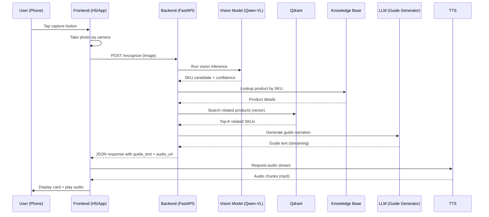

# Architecture Design

## Overview

Smart Shopping Guide Agent is the first scenario application built on top of the **KWeaver Box** edge AI platform. This document describes its end-to-end architecture and integration points.

## High-Level Architecture

```
┌──────────────────────────────────────────────────────────────┐
│                  Client Layer (Phone / Tablet)                │
├──────────────────────────────────────────────────────────────┤
│  Phase 1:  H5 (Vue 3)  ──┐                                   │
│  Phase 2:  Native App ───┤                                   │
│            (Flutter)     │                                   │
└──────────────────────────┼───────────────────────────────────┘
                           │ HTTPS / WSS (LAN)
                           ▼
┌──────────────────────────────────────────────────────────────┐
│           Edge Compute Box (FusionXpark GB10 / etc.)          │
├──────────────────────────────────────────────────────────────┤
│  ┌──────────────────────────────────────────────────────┐   │
│  │  FastAPI Service (Python)                             │   │
│  │  - /recognize  : Image → SKU + Guide                  │   │
│  │  - /chat/{sku} : WebSocket Q&A                        │   │
│  │  - /tts        : Streaming text-to-speech             │   │
│  │  - /products   : Knowledge base CRUD                  │   │
│  └────┬───────────────────┬──────────────────────────────┘   │
│       │                   │                                   │
│       ▼                   ▼                                   │
│  ┌─────────┐         ┌─────────┐         ┌──────────────┐    │
│  │ Qwen2.5 │         │ Qdrant  │         │ Knowledge    │    │
│  │ -VL-7B  │         │ Vector  │         │ Base (YAML)  │    │
│  │ (vLLM)  │         │ DB      │         │              │    │
│  └─────────┘         └─────────┘         └──────────────┘    │
│       ▲                   ▲                      ▲            │
│       └───────────────────┴──────────────────────┘            │
│                  Local-only, no external calls                │
└──────────────────────────────────────────────────────────────┘
                           │
                           │ (Optional, future)
                           ▼
┌──────────────────────────────────────────────────────────────┐
│              KWeaver DIP (Cloud)                              │
│  - Cross-store insights                                       │
│  - Model fine-tuning                                          │
│  - Performance benchmarks                                     │
└──────────────────────────────────────────────────────────────┘
```

## Key Design Decisions

### 1. Edge-First, Cloud-Optional

All core functionality runs on the edge box. The cloud (KWeaver DIP) is **only** used for:
- Cross-store analytics (with explicit consent)
- Model fine-tuning data collection (anonymized)
- Performance telemetry

**Rationale**: Customer data must not leave the store. Compliance and privacy first.

### 2. Stateless Backend

The FastAPI service is stateless. All persistent data goes to:
- Qdrant (vector embeddings)
- Filesystem (knowledge base YAML, model cache)
- (Future) PostgreSQL for transaction history if needed

**Rationale**: Easy horizontal scaling, easy backup/restore.

### 3. WebSocket for Chat, HTTP for Single-Shot

- `/recognize` is a single-shot HTTP POST (image in, guide out).
- `/chat/{sku}` uses WebSocket for streaming token-by-token LLM responses.

**Rationale**: Better UX for chat (typing indicator, cancellable), simpler for one-shot recognition.

### 4. Knowledge Base as YAML Files

Product data is stored as human-readable YAML rather than a database.

**Rationale**:
- Easy for non-technical staff to edit
- Version control via git (audit trail)
- Trivially exportable/importable
- Will scale to thousands of SKUs without performance issues

For very large catalogs (10k+ SKUs), can migrate to PostgreSQL with the same schema.

## Data Flow: Recognize Request



## Performance Targets

| Metric | Target |
|--------|--------|
| Vision recognition latency | < 1.5s |
| Guide generation latency | < 3s (first token) |
| End-to-end (image → audio start) | < 5s |
| Concurrent users (GB10) | 50+ |
| Concurrent users (Jetson AGX) | 5-10 |
| Offline operation | 100% functional after model + KB loaded |

## Security & Privacy

- **Data residency**: All inference happens on-premise. Images and queries never leave the edge box.
- **Authentication**: JWT-based for backend admin operations. Anonymous access for end-user features (configurable).
- **Network**: Backend binds to LAN only by default. External access requires explicit reverse proxy + auth.
- **Audit**: All recognition events logged locally for compliance (configurable retention).

## Integration with KWeaver Box

This application is designed to be packaged as a `.kwapp` for the KWeaver Box AppHub:

- `manifest.kweaver.yaml` - declares scenario (retail/dealership/etc.), required models, ROI metrics
- Helm Chart - K3s deployment templates
- Knowledge base seed - sample products
- Mobile app template - Android Flutter shell

When KWeaver Box AppHub is ready, installation will be a single click from the AppHub UI.

## Future Enhancements

- **Voice input**: Wake word + ASR for hands-free
- **AR overlay**: Project info on product via camera (Phase 3+)
- **Multi-store sync**: Knowledge base sync across stores
- **A/B testing**: Test different guide scripts for conversion impact
- **Conversion tracking**: Link recognitions → purchases via QR code
