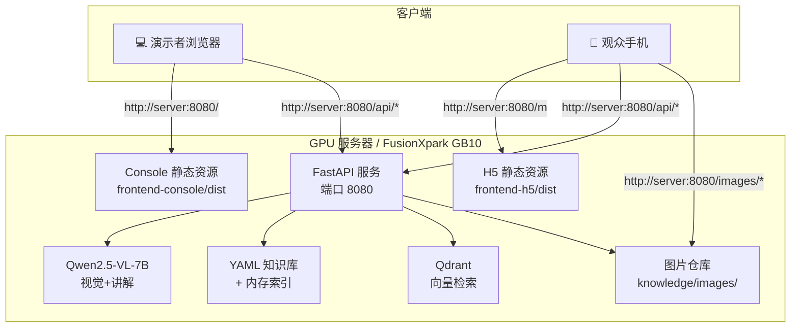
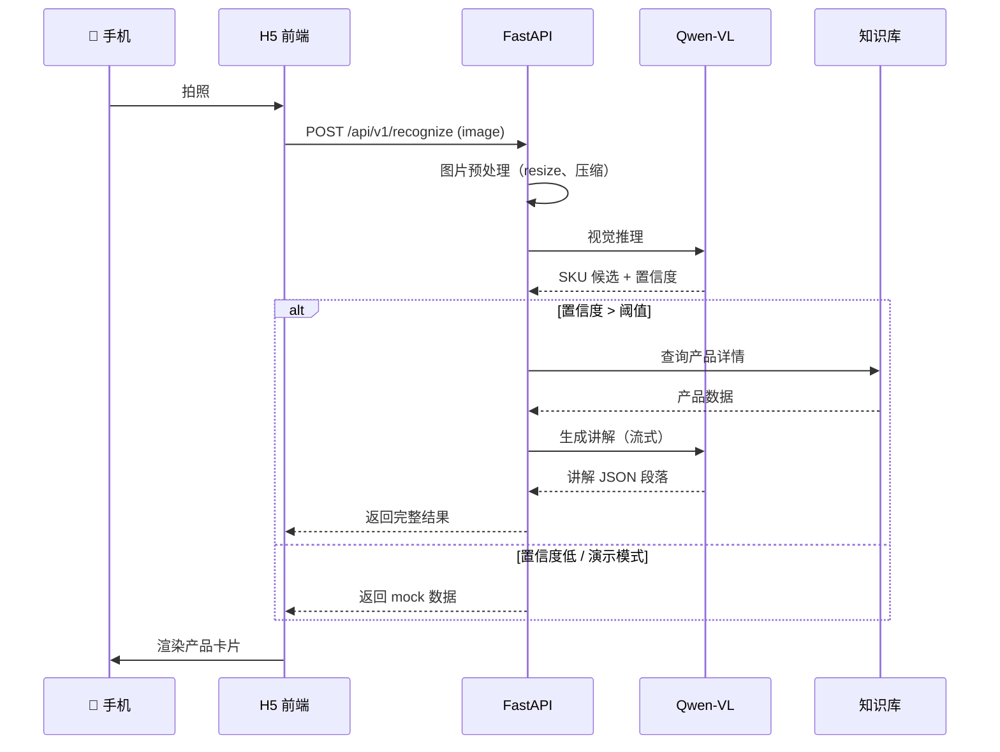
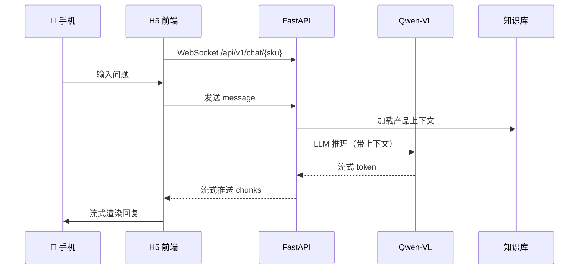

# 智能导购 Agent — 产品需求文档（PRD）

> **Smart Shopping Guide Agent — Product Requirements Document**

---

## 文档信息

| 字段 | 内容 |
|------|------|
| 文档版本 | v1.0 |
| 创建日期 | 2026-05-07 |
| 文档状态 | Draft（待评审） |
| 适用范围 | KWeaver Box 平台首批标杆 .kwapp 应用 |
| 关联项目 | [smart-shopping-guide-agent](https://github.com/kerrykuang2023/smart-shopping-guide-agent) |
| 上游产品 | KWeaver Box（边缘 AI 操作系统） |

---

## 目录

- [1. 项目背景](#1-项目背景)
- [2. 产品目标](#2-产品目标)
- [3. 范围界定](#3-范围界定)
- [4. 目标用户与角色](#4-目标用户与角色)
- [5. 使用场景](#5-使用场景)
- [6. 功能需求](#6-功能需求)
- [7. 非功能需求](#7-非功能需求)
- [8. UI / UX 设计要求](#8-ui--ux-设计要求)
- [9. 技术架构](#9-技术架构)
- [10. 数据模型](#10-数据模型)
- [11. API 规范](#11-api-规范)
- [12. 演示流程设计](#12-演示流程设计)
- [13. 成功标准](#13-成功标准)
- [14. 风险与应对](#14-风险与应对)
- [15. 项目里程碑](#15-项目里程碑)
- [16. 附录](#16-附录)

---

## 1. 项目背景

### 1.1 业务背景

KWeaver Box 是面向企业现场的边缘 AI 操作系统，定位为"算力盒子 + AppHub 平台 + 数字员工应用（.kwapp）"的整体解决方案。在 GTM 启动阶段，需要一个能快速验证场景价值、易于演示和复制的标杆应用，作为对外推广的"杀手锏"。

经过场景评估，**智能导购** 因其多重优势被选为首批标杆 .kwapp：

- **演示效果震撼**：手机一拍，AI 讲解，秒懂秒服
- **企业价值清晰**：转化率提升、培训成本降低、人力效率
- **技术栈成熟**：视觉 + LLM 已经被 Qwen2.5-VL 等开源模型很好地解决
- **复制性极强**：从 1 个 SKU 到 1000 个 SKU 只是知识库扩展
- **行业广泛**：零售、4S 店、家电、医疗器械、博物馆、展会均适用

### 1.2 痛点分析

传统零售/导购场景的核心痛点：

| 痛点 | 现状 | 影响 |
|------|------|------|
| 导购员能力差异大 | 金牌销售 vs 新人讲解差距巨大 | 转化率不稳定 |
| 培训成本高且慢 | 新人成长需 3-6 个月 | 流失高，培训沉没成本大 |
| 产品知识难统一 | 产品迭代快，话术更新滞后 | 销售给出错误信息 |
| 高峰期人力不足 | 客流高峰销售忙不过来 | 顾客流失 |
| 顾客自主探索难 | 产品复杂，顾客看不懂 | 决策周期长 |
| 数据沉淀缺失 | 销售过程黑盒 | 无法分析优化 |

### 1.3 解决方案概述

KWeaver Box 边缘盒子部署 **智能导购 Agent**，通过：

1. **视觉识别**：手机拍摄产品，AI 自动识别 SKU
2. **专业讲解**：基于产品知识库生成卖点讲解（图文 + 语音）
3. **互动问答**：顾客追问，AI 实时回答
4. **关联推荐**：搭配套餐、竞品对比、优惠组合
5. **完全离线**：数据不出店，断网也能用

让每个顾客或导购员都能获得"金牌销售"级别的产品讲解体验。

---

## 2. 产品目标

### 2.1 核心目标（Demo 阶段）

> **用最低成本验证"边缘 AI 智能导购"场景的真实价值，为 KWeaver Box 整体平台决策提供依据。**

### 2.2 衡量目标的 OKR

**O：成为 KWeaver Box 首个被市场认可的杀手级应用**

- KR1：完成 1 次老板/投资人级别的演示，决策"继续投入" ✅
- KR2：在 5-6 月签约 6-8 家共创客户，至少 2 家落地完整场景
- KR3：演示视频/截图能在客户内部转发，3 周内被 100+ 业务负责人观看
- KR4：3 个月内基于此应用沉淀 3 个可复用行业 .kwapp 模板

### 2.3 非目标（Non-Goals）

明确**不**追求的东西，避免范围蔓延：

- ❌ 不追求覆盖所有零售场景，先聚焦 3-5 个 SKU
- ❌ 不追求生产级稳定性，Demo 阶段允许重启、降级、Mock
- ❌ 不追求多用户并发，单用户演示流畅即可
- ❌ 不追求与企业系统深度集成，ERP/WMS 留到 Phase 3
- ❌ 不追求商业化定价，Demo 与 PoC 阶段全部免费共创

---

## 3. 范围界定

### 3.1 In Scope（Demo 必做）

| 模块 | 内容 | 优先级 |
|------|------|------|
| 后端服务 | FastAPI + Qwen2.5-VL + 知识库 + Qdrant | P0 |
| 服务端 Console | Web 管理界面（包含 QR Code 入口） | P0 |
| 移动端 H5 | Vue 3 + 摄像头 + 拍照识别 | P0 |
| 知识库 | 3-5 个 SKU 的 YAML 数据 | P0 |
| 产品图片库 | 每 SKU 5-6 张图（主图 + 多角度 + 关联） | P0 |
| Docker 部署 | 单容器一键启动 | P0 |
| AI 讲解生成 | LLM 生成 30-50 字段的多段讲解 | P0 |
| 关联推荐 | 图片 + 名称 + 价格的推荐卡片 | P0 |
| 竞品对比 | 双产品图文对比 | P1 |
| 互动问答 | WebSocket 实时对话 | P1 |
| 调用日志 | Console 端展示最近识别记录 | P1 |
| 演示模式 | 识别失败时返回 mock 保证演示稳定 | P0 |

### 3.2 Out of Scope（Demo 不做，留待后续）

| 模块 | 推迟原因 | 何时实现 |
|------|---------|---------|
| Flutter 原生 App | H5 已能验证场景 | Phase 2 |
| 1Panel 应用包打包 | Demo 直接 docker run | Phase 2 |
| ERP/WMS 集成 | Demo 用静态价格库存 | Phase 3 |
| 多用户/权限管理 | Demo 单用户 | Phase 3 |
| ROI 看板 | 需真实数据沉淀 | Phase 3 |
| 语音输入（ASR） | 输入交互复杂度高 | Phase 4 |
| 离线缓存优化 | Demo 网络可控 | Phase 2 |
| 多语言（英文） | Demo 中文即可 | Phase 3 |
| 性能压测 | Demo 单人为主 | Phase 4 |
| 模型微调 | 直接用预训练 | Phase 4 |
| HTTPS / 安全加固 | Demo 内网 | Phase 2 |
| 100+ SKU 规模 | 验证 3-5 个先 | Phase 3 |

---

## 4. 目标用户与角色

### 4.1 用户角色矩阵

| 角色 | 描述 | 主要使用场景 | 主要使用端 |
|------|------|------------|----------|
| **演示者** | KWeaver 售前/PM | 现场演示、客户沟通 | 服务端 Console |
| **管理员** | 客户 IT 或运营 | 配置知识库、管理模型 | 服务端 Console |
| **导购员** | 客户一线销售 | 辅助讲解、应对客户问题 | 移动端 H5 |
| **顾客** | 终端消费者 | 自助识别产品、获取讲解 | 移动端 H5 |
| **业务决策者** | 客户老板/区域经理 | 查看演示、查看 ROI 数据 | 服务端 Console |

### 4.2 典型用户画像

#### 画像 1：演示者 — 张销售

- 35 岁，KWeaver 资深售前，技术背景中等
- 每周需要给 2-3 家潜在客户做演示
- 痛点：传统 PPT 演示无法打动客户，需要"哇时刻"
- 期待：5 分钟内让客户决策"我们要 PoC"

#### 画像 2：导购员 — 小李

- 25 岁，门店一线销售，入职 2 个月
- 对产品参数不熟，依赖老员工带教
- 痛点：客户问到细节就答不上来，转化率低
- 期待：手机打开就能查任何产品信息

#### 画像 3：顾客 — 王女士

- 35 岁，注重生活品质的消费者
- 不想被销售骚扰，喜欢自主探索
- 痛点：产品太多看不懂，怕被"忽悠"
- 期待：不依赖销售员，自己能获取专业讲解

---

## 5. 使用场景

### 5.1 场景 1：内部老板汇报（最先发生）

**目的**：让老板/PM/投资人看到"AI 导购"的真实效果，决定是否投入更多资源

**地点**：会议室

**参与者**：演示者 + 老板 + 业务决策者

**关键诉求**：
- 5 分钟内完成核心演示
- 现场不能翻车
- 让老板能用自己的手机体验
- 演示后能直接讨论"下一步投入"

**完整脚本**：见 [12. 演示流程设计](#12-演示流程设计)

### 5.2 场景 2：种子客户共创演示

**目的**：与 1-3 家潜在共创客户初次接触，证明 PoC 价值，签约共创合同

**地点**：客户公司会议室或工厂车间

**参与者**：KWeaver 商务 + 客户业务负责人 + 客户 IT

**关键诉求**：
- 提前用客户自己的产品配置知识库（如客户主推 SKU）
- 现场用客户实物演示，不是用 KWeaver 准备的样品
- 突出"硬件 + 软件 + 共创"商业模式
- 现场能签 LOI 或共创合同

### 5.3 场景 3：行业展会/技术沙龙

**目的**：曝光 KWeaver Box 品牌，吸引 ISV/渠道伙伴关注

**地点**：展会展台

**参与者**：路过观众（不限）

**关键诉求**：
- 展台摆 5-10 件不同行业产品
- 观众用自己手机扫码即可体验
- 自动统计扫码次数，给观众正反馈
- 强调"这只是 KWeaver Box 上的一个 .kwapp"

### 5.4 场景 4：客户实际门店应用（Phase 2+）

**目的**：客户门店真实部署，导购员日常使用

**地点**：零售门店

**参与者**：导购员 + 顾客

**关键诉求**：
- 平板固定在展台，开机自启
- 7×24 小时稳定运行
- 多个客户同时使用
- 与门店 ERP 集成实时价格

> 此场景非 Demo 范围，留待 Phase 2-3 实现。

---

## 6. 功能需求

### 6.1 服务端 Console 功能

#### F1.1 Dashboard 主页

**优先级**：P0

**功能描述**：
- 显示服务运行状态（在线/离线、CPU/GPU 使用率）
- 显示今日/本周调用统计（识别次数、成功率）
- 显示 Top 5 识别产品
- 快捷入口：移动端 QR Code、知识库管理、模型配置

**验收标准**：
- 进入 Console 首页 1 秒内加载完成
- 关键指标（调用次数、成功率）实时刷新
- 移动端入口按钮明显，点击后展示 QR Code 全屏

#### F1.2 移动端入口（QR Code 页面）

**优先级**：P0（演示核心）

**功能描述**：
- 全屏展示大尺寸 QR Code（350×350px 以上）
- 自动检测当前服务器 IP，动态生成 QR Code
- 显示备选访问 URL 文本（防止扫码失败）
- 显示演示提示（WiFi、摄像头权限等）
- 实时显示已扫码人数
- 服务状态指示灯

**验收标准**：
- QR Code 用主流手机扫码（微信、原生相机）能正确跳转
- IP 变化（如重新部署）QR Code 自动更新
- 备选 URL 文本能手动输入访问

#### F1.3 知识库管理

**优先级**：P0

**功能描述**：
- 产品列表：表格展示所有 SKU、缩略图、价格、最近修改时间
- 新增产品：表单填写 + 图片上传
- 编辑产品：修改基本信息、上传/删除图片、调整卖点
- 删除产品：带确认弹窗
- 图片管理：拖拽排序、批量上传、自动压缩

**验收标准**：
- 产品列表分页加载，30 个产品内单页加载 < 1 秒
- 图片上传支持 JPG/PNG/WebP，单张 < 10MB
- 上传后自动生成 thumbnail（200×200）+ medium（800×800）
- 编辑保存后立即生效，无需重启服务

#### F1.4 模型管理

**优先级**：P1

**功能描述**：
- 显示当前使用的模型名称、参数量、加载状态
- 模型切换（仅展示，Demo 阶段不实际切换）
- 模型参数调整（温度、最大长度等）
- 模型预热触发

**验收标准**：
- 当前模型信息准确显示
- 参数调整后立即生效
- Demo 阶段允许仅展示不实际切换

#### F1.5 调用日志

**优先级**：P1

**功能描述**：
- 时间倒序展示最近 100 条识别记录
- 每条记录包含：时间、上传图片缩略图、识别 SKU、置信度、AI 讲解片段
- 支持按 SKU 筛选
- 支持导出 CSV

**验收标准**：
- 新识别请求 1 秒内出现在日志中
- 点击日志条目可查看完整讲解内容

#### F1.6 系统设置

**优先级**：P2

**功能描述**：
- 服务端口配置（重启后生效）
- 模型存储路径
- 知识库存储路径
- 演示模式开关（识别失败时返回 mock）
- 日志保留时长

### 6.2 移动端 H5 功能

#### F2.1 拍照识别页（首页）

**优先级**：P0

**功能描述**：
- 进入页面立即调起后置摄像头
- 全屏摄像头预览 + 中央"拍照"圆形按钮
- 顶部显示提示文字："对准产品，点击拍照"
- 底部"上传相册"备选按钮（应对摄像头权限被拒）
- 拍照后立即显示加载动画 + 上传到后端

**验收标准**：
- iOS Safari 和 Android Chrome 均能正常调起摄像头
- 摄像头权限被拒时有友好提示
- 网络错误时有重试按钮

#### F2.2 识别结果展示页

**优先级**：P0

**功能描述**：
- 顶部大尺寸主图（16:9 或 4:3）
- 多角度图片轮播或缩略图横向滑动
- 产品名称、价格、规格简介
- AI 讲解段落（带配图，3-5 段）
- "搭配推荐"模块（图片网格）
- "竞品对比"模块（双图对照）
- 底部固定"返回拍照"+"追问"按钮

**验收标准**：
- 主图加载完成前显示模糊占位图
- 所有图片懒加载（IntersectionObserver）
- 滚动流畅，无卡顿
- 移动端适配 iPhone 和 Android 主流屏幕

#### F2.3 互动问答页

**优先级**：P1

**功能描述**：
- 类似聊天界面，气泡形式
- 输入框 + 发送按钮（暂不支持语音输入）
- AI 回复支持图文混排（推荐产品时返回卡片）
- 自动滚动到最新消息
- 显示"AI 正在输入..."加载状态

**验收标准**：
- WebSocket 连接稳定，断线自动重连
- 回复 token 流式输出，体验流畅

#### F2.4 移动端导航

**优先级**：P0

**功能描述**：
- 顶部 logo 和"KWeaver 智能导购"标识
- 页面间流畅过渡动画
- 历史记录页（本次会话识别过的产品）

### 6.3 后端服务功能

#### F3.1 视觉识别引擎

**优先级**：P0

**功能描述**：
- 接收 H5 上传的图片（JPG/PNG，最大 10MB）
- 使用 Qwen2.5-VL-7B 进行推理
- 返回识别的 SKU + 置信度
- 置信度低于阈值时返回"未识别"

**验收标准**：
- 识别准确率 > 80%（针对预设的 3-5 个 SKU）
- 单次推理 < 1.5 秒（GB10）
- GPU 显存占用 < 16GB

#### F3.2 知识库查询

**优先级**：P0

**功能描述**：
- 启动时自动加载 `knowledge/products/*.yaml`
- 内存中维护 SKU → Product 的索引
- 支持按 SKU 直接查询
- 支持向量检索（找相似产品）

**验收标准**：
- 启动加载时间 < 5 秒（3-5 个 SKU）
- 查询响应 < 50ms
- 文件修改后自动重新加载（开发模式）

#### F3.3 讲解生成

**优先级**：P0

**功能描述**：
- 基于产品知识库 + Prompt 模板生成讲解
- 输出 JSON 格式：分段文字 + 配图引用
- 支持流式输出（SSE 或 WebSocket）
- 支持多种"讲解风格"（专业、亲切、简洁）

**验收标准**：
- 首字延迟 < 2 秒
- 完整讲解 3-5 段，每段 30-50 字
- 图片引用必须存在于知识库中（不能虚构）

#### F3.4 互动问答

**优先级**：P1

**功能描述**：
- WebSocket 接受顾客追问
- 基于产品知识库 + 上下文回答
- 支持多轮对话（保持会话上下文）
- 支持返回结构化推荐卡片

**验收标准**：
- 对话连续 10 轮无失忆
- 不能虚构产品信息

#### F3.5 QR Code 生成

**优先级**：P0

**功能描述**：
- 自动检测局域网 IP
- 生成 PNG 格式 QR Code
- 支持自定义尺寸

**验收标准**：
- 任何主流手机扫码均能跳转
- IP 变化后自动更新

#### F3.6 图片管理

**优先级**：P0

**功能描述**：
- 静态图片托管（`/images/{filename}`）
- 上传 API（multipart/form-data）
- 自动生成多尺寸（thumbnail / medium / full）
- 自动转 WebP（浏览器支持时）
- HTTP 缓存头设置

**验收标准**：
- 图片首次访问后浏览器缓存 1 天
- WebP 体积比 JPG 减少 30%+

#### F3.7 演示模式

**优先级**：P0

**功能描述**：
- 通过环境变量或 Console 开关启用
- 启用时：识别失败 → 随机返回一个预设产品
- 启用时：API 错误 → 返回友好降级数据
- 启用时：在响应中标注 `mocked: true`（前端可识别）

**验收标准**：
- 任何错误都不会让前端显示"识别失败"
- 演示模式状态在 Console 端可见

---

## 7. 非功能需求

### 7.1 性能需求

| 指标 | 目标值 | 说明 |
|------|------|------|
| 视觉识别延迟 | < 1.5s | 单张图片 → SKU |
| 讲解生成首字延迟 | < 2s | LLM 流式输出第一个 token |
| 端到端延迟（拍照 → 看到结果） | < 5s | 用户感知核心指标 |
| H5 首屏加载 | < 2s | 4G 网络下 |
| 图片懒加载 | 立即可见 | 滚动时不卡顿 |
| Console 主页加载 | < 1s | 内网 |
| 单人演示流畅度 | 60fps | 无卡顿 |

### 7.2 可用性需求

| 指标 | 目标值 |
|------|------|
| 演示场景识别成功率 | > 95%（含演示模式兜底） |
| 服务启动时间 | < 30s（含模型加载） |
| 服务连续运行 | 单次演示 ≥ 4 小时不重启 |
| 浏览器兼容性 | iOS Safari 14+、Android Chrome 90+ |

### 7.3 安全需求

| 项目 | 要求 |
|------|------|
| 数据本地化 | 所有图片、识别结果不离开服务器 |
| 网络隔离 | 默认仅监听局域网（非 0.0.0.0） |
| 上传校验 | 文件类型 + 大小限制 |
| Console 访问控制 | Demo 阶段无认证，Phase 2 加 JWT |
| 日志脱敏 | 不记录顾客个人信息 |

### 7.4 部署需求

| 项目 | 要求 |
|------|------|
| 部署形态 | 单 Docker 容器 |
| 启动方式 | `docker run` 一行命令 |
| 配置方式 | 环境变量 + YAML 配置 |
| 日志输出 | 标准输出（stdout） |
| 监控接口 | `/health` + `/metrics` |
| 资源占用 | < 16GB GPU 显存 |

### 7.5 可维护性需求

- 代码符合 PEP 8 / ESLint 规范
- 关键模块单元测试覆盖率 > 50%
- API 文档自动生成（FastAPI Swagger）
- 提交规范：Conventional Commits

---

## 8. UI / UX 设计要求

### 8.1 设计原则

- **图片优先**：图片是体验核心，文字是补充
- **零学习曲线**：用户拿起手机即知道下一步做什么
- **演示友好**：每个屏幕都能成为"演示金句"的视觉支撑
- **品牌一致**：与 KWeaver Box 整体视觉语言对齐

### 8.2 视觉风格

#### 服务端 Console
- **风格**：现代企业级（参考 Coolify、Vercel Dashboard）
- **主色**：深色系 + 蓝紫渐变强调色
- **字体**：Inter / 思源黑体
- **组件库**：Element Plus 或 Naive UI

#### 移动端 H5
- **风格**：苹果风极简 + 大量留白
- **主色**：白底 + 重点色（如品牌橙/蓝）
- **字体**：iOS 默认字体 + 思源黑体
- **组件库**：Vant 或自研

### 8.3 关键页面线框

#### 8.3.1 Console - QR Code 页面（演示核心）

```
┌──────────────────────────────────────────────────────┐
│  KWeaver Box · 智能导购 · 移动端入口                   │
├──────────────────────────────────────────────────────┤
│                                                        │
│         请用手机扫描下方二维码体验                       │
│                                                        │
│         ┌────────────────────────────┐                 │
│         │                            │                 │
│         │      [大尺寸 QR Code]       │                 │
│         │      350 x 350 px          │                 │
│         │                            │                 │
│         └────────────────────────────┘                 │
│                                                        │
│   或访问： http://192.168.1.100:8080/m                 │
│                                                        │
│   📌 演示提示：                                         │
│      ✓ 手机需连接当前局域网 WiFi                        │
│      ✓ 浏览器允许访问摄像头                            │
│      ✓ 后置摄像头拍摄效果更佳                          │
│                                                        │
│  ────────────────────────────────────────────────     │
│                                                        │
│  📊 已扫码人数：3        🟢 服务状态：正常              │
│                                                        │
└──────────────────────────────────────────────────────┘
```

#### 8.3.2 移动端 - 识别结果页

```
┌─────────────────────────────────┐
│ ←  识别结果                       │
├─────────────────────────────────┤
│                                  │
│ ┌────────────────────────────┐   │
│ │                            │   │
│ │    [产品主图，全宽]         │   │
│ │                            │   │
│ └────────────────────────────┘   │
│                                  │
│ iPhone 15 Pro 256GB 黑色钛金属    │
│ ¥8,999                           │
│                                  │
│ 📷 [图1] [图2] [图3] [图4]       │
│                                  │
│ ─────────────────────────       │
│                                  │
│ ✨ AI 智能讲解                    │
│                                  │
│ 这款 iPhone 15 Pro 采用航空级     │
│ 钛金属机身...                     │
│ ┌────────────────┐               │
│ │ [钛金属特写图] │               │
│ └────────────────┘               │
│                                  │
│ 搭载最新 A17 Pro 芯片...          │
│ ┌────────────────┐               │
│ │ [A17 芯片图]   │               │
│ └────────────────┘               │
│                                  │
│ ─────────────────────────       │
│                                  │
│ 🎁 搭配推荐                       │
│ ┌──────┐ ┌──────┐ ┌──────┐       │
│ │[图]  │ │[图]  │ │[图]  │       │
│ │耳机  │ │充电器│ │保护壳│       │
│ │¥1899 │ │¥329  │ │¥399  │       │
│ └──────┘ └──────┘ └──────┘       │
│                                  │
│ 🆚 竞品对比                       │
│ [iPhone] vs [华为]               │
│                                  │
│ ─────────────────────────       │
│                                  │
│ [💬 追问]    [📷 重新拍照]         │
│                                  │
└─────────────────────────────────┘
```

### 8.4 交互细节

- 点击拍照按钮有触觉反馈（vibrate）
- 上传中显示进度条
- 识别成功后页面平滑滚动到结果
- 推荐卡片点击后弹出大图
- 所有按钮 tap 区域 ≥ 44×44 px

---

## 9. 技术架构

### 9.1 系统架构图



### 9.2 技术栈

| 层 | 选型 | 版本 | 用途 |
|----|------|------|------|
| 后端语言 | Python | 3.11+ | 主语言 |
| Web 框架 | FastAPI | 0.110+ | HTTP/WebSocket |
| AI 推理 | Transformers + PyTorch | 4.45+ / 2.4+ | Qwen-VL 推理 |
| 模型 | Qwen/Qwen2.5-VL-7B-Instruct | - | 视觉+讲解 |
| 向量库 | Qdrant | 1.10+ | 关联检索 |
| 嵌入模型 | BGE-M3 | - | 中文语义嵌入 |
| Console 前端 | Vue 3 + Vite | 3.4+ | 管理界面 |
| Console UI | Element Plus 或 Naive UI | latest | 桌面 UI |
| H5 前端 | Vue 3 + Vite | 3.4+ | 移动界面 |
| H5 UI | Vant | 4.x | 移动 UI |
| HTTP 客户端 | Axios | 1.7+ | API 调用 |
| WebSocket | 原生 WebSocket API | - | 实时通信 |
| 容器化 | Docker + Compose | latest | 部署 |
| QR Code 生成 | qrcode (Python) | latest | QR 生成 |
| 图片处理 | Pillow | 10+ | 缩放、转 WebP |

### 9.3 部署拓扑

```
┌─────────────────────────────────────────┐
│  GPU 服务器（一台）                       │
│  ┌───────────────────────────────────┐  │
│  │  Docker 容器 (单实例)              │  │
│  │  ┌────────────────────────┐       │  │
│  │  │  FastAPI               │       │  │
│  │  │  ├── /         Console │       │  │
│  │  │  ├── /m        H5      │       │  │
│  │  │  ├── /api/v1/* API     │       │  │
│  │  │  ├── /images/* 图片     │       │  │
│  │  │  └── /docs     Swagger │       │  │
│  │  └────────────────────────┘       │  │
│  │  挂载卷：                           │  │
│  │  - knowledge/  (产品+图片)         │  │
│  │  - models/     (AI 模型权重)       │  │
│  └───────────────────────────────────┘  │
│  暴露端口：8080                          │
└─────────────────────────────────────────┘
              ↑ 局域网 WiFi
       ┌──────┴──────┐
   💻 笔记本        📱 手机
```

### 9.4 数据流

#### 9.4.1 拍照识别流程



#### 9.4.2 互动问答流程



---

## 10. 数据模型

### 10.1 产品知识库 Schema

完整 schema 见 [`knowledge/schema.yaml`](../knowledge/schema.yaml)。核心字段：

```yaml
sku: string                    # 唯一 ID
name: string                   # 显示名称
category: string               # 类别
brand: string                  # 品牌
price: number                  # 价格（CNY）

primary_image: string          # 主图 URL（必需）

gallery:                       # 多角度图
  - url: string
    angle: string              # front/back/side/...
    caption: string

selling_points:                # 卖点（每个可配图）
  - text: string
    image: string?

related_products:              # 关联推荐
  - sku: string
    name: string
    image: string
    price: number
    bundle_discount: number?
    reason: string

competitors:                   # 竞品对比
  - sku: string
    name: string
    image: string
    price: number
    our_advantages: [string]
    their_advantages: [string]

specs: [string]                # 规格
target_users: [string]         # 目标用户
use_cases: [string]            # 使用场景
promotions: [object]           # 促销活动
```

### 10.2 识别结果数据模型

```typescript
interface RecognizeResponse {
  sku: string;
  confidence: number;           // 0-1
  mocked: boolean;              // 是否演示模式
  
  product: {
    name: string;
    primary_image: string;
    gallery: ImageItem[];
    price: number;
    specs: string[];
  };
  
  guide_segments: GuideSegment[];
  
  related_products: RelatedProduct[];
  
  competitors: Competitor[];
}

interface GuideSegment {
  text: string;
  image_ref?: string;
  image_caption?: string;
}

interface ImageItem {
  url: string;
  caption?: string;
}
```

### 10.3 调用日志

```yaml
- timestamp: "2026-05-07T15:30:00Z"
  request_id: "uuid"
  client_ip: "192.168.1.50"
  user_agent: "Mozilla/5.0..."
  image_thumbnail: "/logs/thumbnails/xxx.jpg"
  recognized_sku: "iPhone-15-Pro-256GB-Black"
  confidence: 0.92
  latency_ms: 1450
  guide_excerpt: "这款 iPhone..."
  mocked: false
```

---

## 11. API 规范

### 11.1 RESTful API

| Method | Path | Purpose | Body | Response |
|--------|------|---------|------|---------|
| GET | `/api/v1/health` | 健康检查 | - | `{status: "ok"}` |
| GET | `/api/v1/metrics` | 性能指标 | - | `{...}` |
| POST | `/api/v1/recognize` | 拍照识别 | multipart image | `RecognizeResponse` |
| GET | `/api/v1/products` | 产品列表 | - | `Product[]` |
| GET | `/api/v1/products/{sku}` | 产品详情 | - | `Product` |
| POST | `/api/v1/products` | 新增产品（管理） | YAML | `Product` |
| PUT | `/api/v1/products/{sku}` | 编辑产品（管理） | YAML | `Product` |
| DELETE | `/api/v1/products/{sku}` | 删除产品（管理） | - | `{}` |
| POST | `/api/v1/images/upload` | 上传图片（管理） | multipart | `{url}` |
| GET | `/api/v1/qr/mobile` | 获取 QR Code | - | PNG image |
| GET | `/api/v1/qr/info` | 获取移动端 URL | - | `{mobile_url}` |
| GET | `/api/v1/logs` | 调用日志 | - | `LogEntry[]` |
| GET | `/api/v1/dashboard/stats` | 仪表板统计 | - | `Stats` |

### 11.2 WebSocket API

| Path | Purpose |
|------|---------|
| `/api/v1/chat/{sku}` | 互动问答（流式） |

#### Chat 协议

客户端 → 服务端：
```json
{
  "type": "message",
  "content": "这款和华为比怎么样？"
}
```

服务端 → 客户端（流式）：
```json
{ "type": "token", "content": "这" }
{ "type": "token", "content": "款" }
{ "type": "token", "content": "iPhone..." }
{ "type": "done" }
```

或：
```json
{ "type": "card", "card_type": "product_recommendation", "data": {...} }
```

### 11.3 静态资源

| Path | Purpose |
|------|---------|
| `/` | Console SPA |
| `/m` | 移动端 H5 SPA |
| `/images/{filename}` | 产品图片（支持 ?w=&h=&q=） |
| `/docs` | Swagger UI（开发调试） |

---

## 12. 演示流程设计

### 12.1 标准演示脚本（5 分钟）

```
─────────────────────────────────────────────────────────────
00:00 │ 演示者打开笔记本浏览器，访问 http://gb10:8080
       │ 屏幕投屏到大屏，给客户看到 Console 主页
       │
00:10 │ 演示者：「这是 KWeaver Box 上的智能导购应用。
       │         我现在打开服务端的管理界面给您看一下。」
       │         
00:20 │ 演示者：「这里我能配置：
       │         - 要识别的产品知识库
       │         - 背后的 AI 模型参数
       │         - 查看实时调用统计」
       │
00:35 │ [点击"移动端入口"，全屏显示大 QR Code]
       │ 演示者：「重点来了，顾客或导购员只需要扫这个码，
       │         就能直接打开移动端体验，无需安装任何 App。」
       │
00:50 │ 客户拿起自己的手机扫码
       │ 客户手机自动打开 H5 页面，显示拍照界面
       │
01:00 │ 演示者：「您看，扫码即开。请您对准这台 iPhone 拍照。」
       │
01:10 │ 客户对准 iPhone 拍照
       │ 客户手机：识别中...（0.5-1 秒）
       │
01:15 │ 客户手机显示：
       │ - iPhone 15 Pro 主图
       │ - 价格、规格
       │ - AI 智能讲解开始展开（带配图）
       │
01:30 │ 演示者：「整个识别和讲解都是在我们的边缘盒子上完成，
       │         您的手机数据没有上传到任何云端，完全本地推理。」
       │
01:50 │ 演示者：「您可以追问，比如问 "和华为比怎么样？"」
       │ 客户输入问题
       │ AI 流式回复对比信息
       │
02:30 │ 演示者：「您看下方还有搭配推荐和竞品对比，
       │         全部都是图文并茂的卡片式呈现。」
       │
03:00 │ 演示者切回 Console：
       │ 「同时管理者在这里能看到刚才的调用记录、
       │   识别结果、以及 AI 给出的讲解内容。」
       │
03:30 │ 演示者：「这个应用只是 KWeaver Box 上的一个 .kwapp，
       │         未来会有几十个不同行业的数字员工应用，
       │         全部都能在这台边缘盒子上运行。」
       │
04:00 │ 演示者：「问题环节，您看这个能用在您的什么业务上？」
       │
05:00 │ 结束
─────────────────────────────────────────────────────────────
```

### 12.2 演示成功的关键

| 准备项 | 要求 |
|------|------|
| GPU 服务器 | 提前 30 分钟启动并预热模型 |
| 产品实物 | 至少 3 件，特征明显，知识库已配置 |
| WiFi 网络 | 演示者手机热点为 Plan B |
| 演示模式 | 默认开启，识别失败兜底 |
| 投屏 | HDMI / AirPlay 提前测试 |
| 备用手机 | 现场如果客户手机扫码失败可借用 |

### 12.3 突发情况应对

| 情况 | 应对 |
|------|------|
| 扫码失败 | 念出备用 URL：「您也可以直接访问 http://...」 |
| 识别错误 | 演示模式兜底，引导："让我换个角度试试" |
| 网络断开 | 切到手机热点，10 秒内恢复 |
| 模型崩溃 | 重启服务（30 秒），同时讲架构故事 |
| 客户深问技术 | 出架构图，5 分钟讲清三层架构 |

---

## 13. 成功标准

### 13.1 功能验收标准

| 功能 | 验收标准 |
|------|---------|
| 视觉识别 | 准确率 ≥ 80%（针对 3-5 个 SKU） |
| 端到端延迟 | ≤ 5 秒（从拍照到看到讲解） |
| 演示稳定性 | 5 分钟演示不出现明显故障 |
| QR Code 体验 | 主流手机 100% 扫码成功 |
| H5 兼容性 | iOS Safari + Android Chrome 均可用 |
| 图片体验 | 所有产品图清晰、加载流畅 |

### 13.2 业务成功标准

| 指标 | 短期目标（1 个月） | 中期目标（3 个月） |
|------|------------------|------------------|
| 演示场次 | 10 场 | 30 场 |
| PoC 客户签约 | 2 家 | 6-8 家 |
| 复制场景数 | 1 个标准场景包 | 3 个行业模板 |
| 媒体/社群曝光 | 1 篇案例 | 3 篇案例 + 1 个视频 |

### 13.3 技术成功标准

| 指标 | 标准 |
|------|------|
| 项目按时交付 | Phase 1 在第 1 周末交付 |
| Bug 数 | P0 = 0，P1 ≤ 3 |
| 代码质量 | Lint 通过、关键路径有测试 |
| 文档完整性 | README、API 文档、部署文档齐全 |

---

## 14. 风险与应对

| 风险 | 等级 | 应对策略 |
|------|------|---------|
| Qwen-VL 识别准确率不达标 | 高 | 演示模式兜底；优选特征明显的产品；可加 fine-tune |
| GB10 设备未就位 | 中 | 用 4090 / 云 GPU 替代验证 |
| 演示时网络不稳定 | 中 | 演示者手机热点；提前部署本地 |
| H5 摄像头权限问题 | 中 | 提供"上传图片"备选；UI 给清晰提示 |
| 模型加载慢 | 低 | 启动时预加载；显示加载进度 |
| 知识库内容质量差 | 中 | 第一周专门安排 1 人编辑产品资料 |
| 演示场景不打动客户 | 高 | 准备多个行业版本，按客户类型切换 |
| 客户深问技术细节 | 中 | 准备技术 Q&A 文档和架构图 |
| 多人同时演示资源不足 | 低 | 演示模式下限制并发；分时段排队 |

---

## 15. 项目里程碑

### Phase 1：MVP H5 Demo（第 1 周，5 个工作日）

| 任务 | 负责人 | 工作量 | 交付物 |
|------|------|------|------|
| 后端基础脚手架 | 后端 | 0.5 天 | FastAPI 项目骨架 |
| Qwen-VL 集成 | 后端 | 1 天 | 视觉识别 API |
| 知识库 + Qdrant | 后端 | 1 天 | 产品检索 |
| 讲解生成 | 后端 | 1 天 | LLM Prompt 工程 |
| 关联推荐 | 后端 | 0.5 天 | 推荐 API |
| Console 前端 | 前端 | 1.5 天 | Dashboard + QR 页面 |
| H5 前端 | 前端 | 2 天 | 拍照 + 结果展示 |
| 知识库准备（3-5 SKU） | PM/内容 | 1.5 天 | YAML + 图片 |
| Docker 化 | 后端 | 0.5 天 | Dockerfile |
| 内部联调 | 全体 | 1 天 | 完整演示 |

**交付**：Friday EOD 完成内部 demo，可对老板演示。

### Phase 2：原生 App + 1Panel 应用包（第 2-3 周）

详见 [`docs/roadmap.md`](roadmap.md)。

### Phase 3：知识库扩展 + ERP 集成（第 4-6 周）

略。

### Phase 4：高级功能（Q2）

略。

### Phase 5：KWeaver Box 集成（Q2-Q3）

略。

---

## 16. 附录

### 16.1 名词解释

| 术语 | 解释 |
|------|------|
| KWeaver Box | KWeaver 推出的边缘 AI 操作系统平台 |
| .kwapp | KWeaver Box 上的标准应用包格式（基于 Helm Chart 扩展） |
| AppHub | KWeaver Box 的应用商店与生命周期管理平台 |
| HAL | Hardware Abstraction Layer，硬件抽象层 |
| FusionXpark GB10 | 超聚变推出的边缘 AI 算力盒子 |
| FusionXplay | 基于 1Panel 的应用管理面板 |
| MCP | Model Context Protocol，工具调用协议 |
| SKU | Stock Keeping Unit，库存单位 |
| PoC | Proof of Concept，概念验证 |
| GTM | Go To Market，市场推广 |

### 16.2 参考资料

- [Qwen2.5-VL 模型文档](https://github.com/QwenLM/Qwen2.5-VL)
- [FastAPI 官方文档](https://fastapi.tiangolo.com/)
- [Vue 3 官方文档](https://vuejs.org/)
- [Vant 移动端组件库](https://vant-ui.github.io/vant/)
- [Qdrant 向量数据库](https://qdrant.tech/)
- [1Panel 应用开发指南](https://1panel.cn/docs/user_manual/appstore/)

### 16.3 变更记录

| 版本 | 日期 | 变更内容 | 作者 |
|------|------|---------|------|
| v1.0 | 2026-05-07 | 初版 | Kerry / Claude |

---

## 评审签字

| 角色 | 姓名 | 评审日期 | 签字 |
|------|------|---------|------|
| 产品负责人 | Kerry | | |
| 技术负责人 | TBD | | |
| 业务负责人 | TBD | | |

---

> 本文档描述了 Smart Shopping Guide Agent 在 Demo 阶段的完整需求。  
> 后续 Phase 2+ 的需求将在新版本 PRD 中持续补充。
